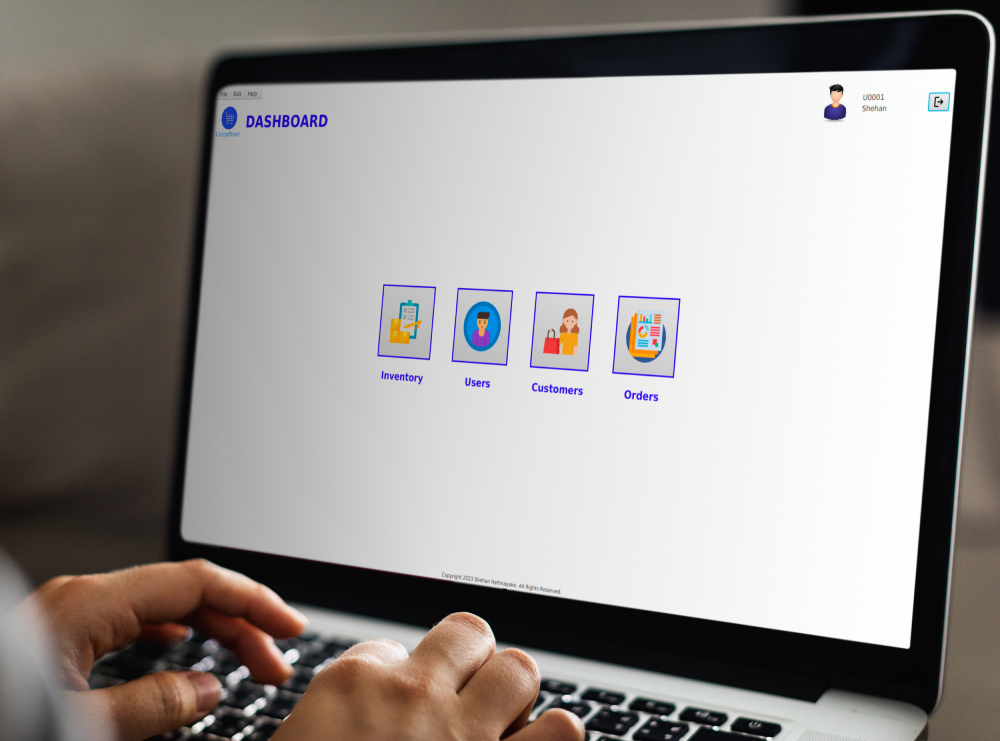
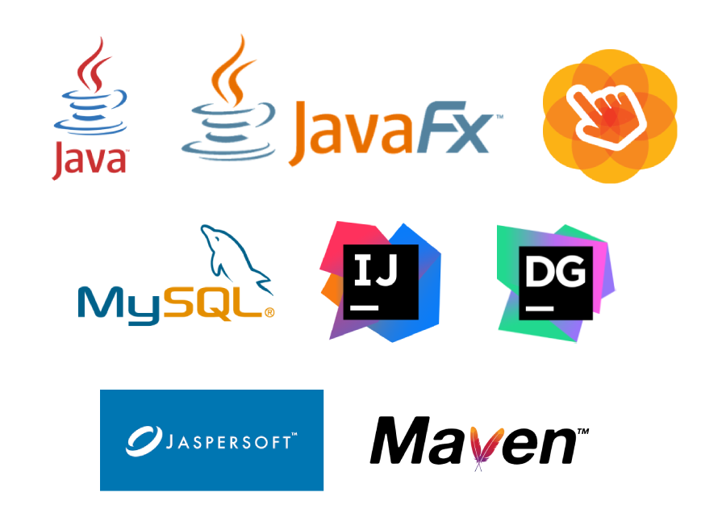
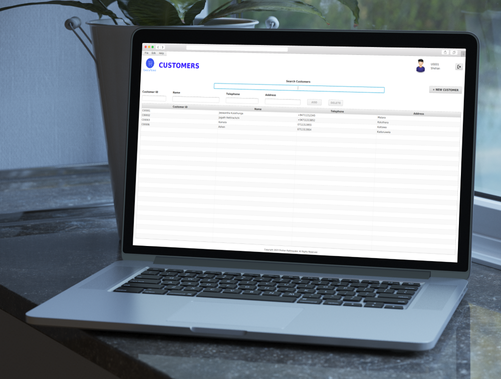
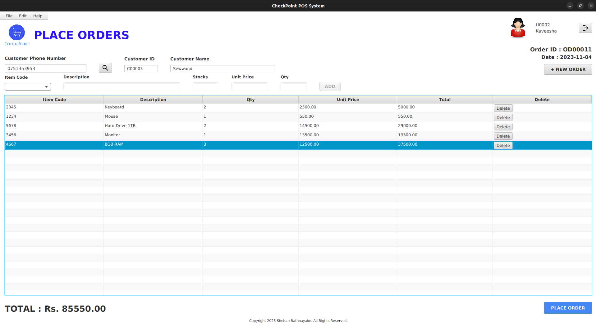
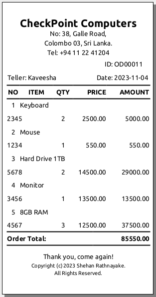
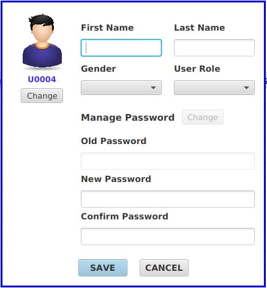
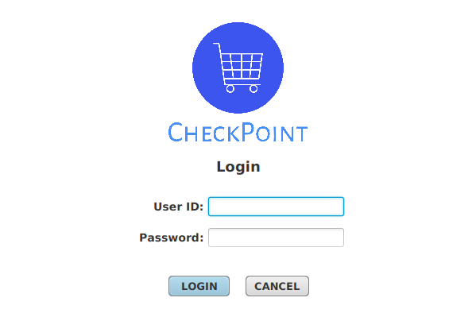

# Clothing Store POS System

## Introduction

In this project, I have designed a Java based POS system to streamline transactions for retail customers and effectively manage Products. The primary goal of this project was to create a solution that provides accuracy, efficiency, and ease of use for shop owners.
## Technologies Used

- Java
- JavaFX
- SceneBuilder
- MySQL
- JasperSoft Studio
- Maven
- intellij IDEA
- DataGrip

 

## Sample Images

 

 

 

 

 

 

### Support

***If you like what I do, maybe consider buying me a coffee*** 🥺 👇

  
